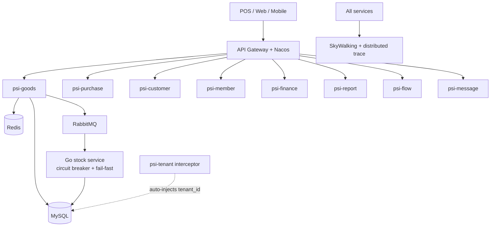

# PSI — Inventory & POS Microservices Platform

> Open-source inventory, warehouse and point-of-sale platform for retail chains.
> Built with **Java 21 + Spring Boot 3** (12 services) and **one Go service** for high-concurrency stock operations.
> Designed for multi-tenant SaaS: event-driven, observable, and safe under load.

---

## What it is

PSI is a production-grade microservices platform I **architected and shipped from zero to production in 18 months**. It runs inventory, purchasing, sales (POS checkout), membership, finance and reporting for retail businesses.

| Metric | Value |
|---|---|
| Java services | 12 (Spring Boot 3.2, Java 21) |
| Go service | 1 (stock concurrency + circuit breaker) |
| REST APIs | ~600 across 94 controllers |
| Maven modules | 24 |
| Domain entities | 120+ |
| Datastores | MySQL 8, Redis 7 |
| Messaging | RabbitMQ (transactional outbox + dead-letter queues) |

---

## Architecture



**Principle:** *move heavy work to when users don't feel it* — compilation, pre-compute and async jobs run off the request path; the cashier's checkout stays fast.

---

## Tech stack

- **Backend:** Java 21, Spring Boot 3.2, Spring Cloud, MyBatis-Plus, Flyway
- **Concurrency:** Go service with circuit-breaker pattern for stock operations
- **Virtual threads:** enabled (Java 21) for high-throughput I/O
- **Data:** MySQL 8, Redis 7
- **Messaging:** RabbitMQ — transactional outbox + 3-layer MQ stack + dead-letter queues with retryability
- **Multi-tenancy:** SQL-rewrite interceptor injecting `tenant_id` at the MyBatis layer
- **Observability:** SkyWalking, TTL distributed tracing, structured logs
- **Infra:** Docker Compose, Nacos (service discovery/config)

---

## Engineering highlights

### 1. Overselling prevention — DB-level CAS + Go circuit breaker
Stock deduction uses **optimistic locking** (version-field CAS update) at the database, not a Redis reservation.
Under load spikes the Go service **fails fast with a circuit breaker** instead of cascading failures.
**Result:** zero overselling at checkout, guaranteed consistency without distributed-state risk.

### 2. Multi-tenant SQL-rewrite interceptor
A MyBatis interceptor rewrites every query to inject `tenant_id` automatically.
This caught a **silent-failure "ghost bug"** where a new query path skipped the tenant filter — fixed before any data leak.

### 3. Zero-code sales-funnel configuration
Customer-journey stage matching uses `source_rule_id` instead of three drifting event-code layers.
Business teams configure **event → journey stage** in the UI; it takes effect immediately, no code change.

---

## Run it locally

```bash
docker-compose up -d
```

Brings up MySQL (3307), Redis and RabbitMQ. Services start on Java 21 with virtual threads enabled.

---

## Modules

| Module | Role |
|---|---|
| `psi-goods` | Inventory, SKU, stock |
| `psi-purchase` | Procurement, inbound |
| `psi-customer` / `psi-member` | Customer & membership |
| `psi-finance` | Accounting, settlement |
| `psi-report` | Analytics, reporting |
| `psi-flow` | Sales funnel / customer journey |
| `psi-message` | Notifications |
| `psi-cashier` | POS checkout UI |
| `psi-frontend` | Web admin |
| `psi-common-starter-*` | Shared starters: tenant, mq, trace, mybatis, async, nacos, order-rule, log, doc |

---

## Author

**Yuping Mo** — Java Backend Architect, 13 years in production.
Remote (UTC+2, full EU/UK overlap).

- GitHub: [@moyuping-java-architect](https://github.com/moyuping-java-architect)
- LinkedIn: [in/yuping-mo-237404429](https://www.linkedin.com/in/yuping-mo-237404429)

Open to European remote backend / architecture roles.
