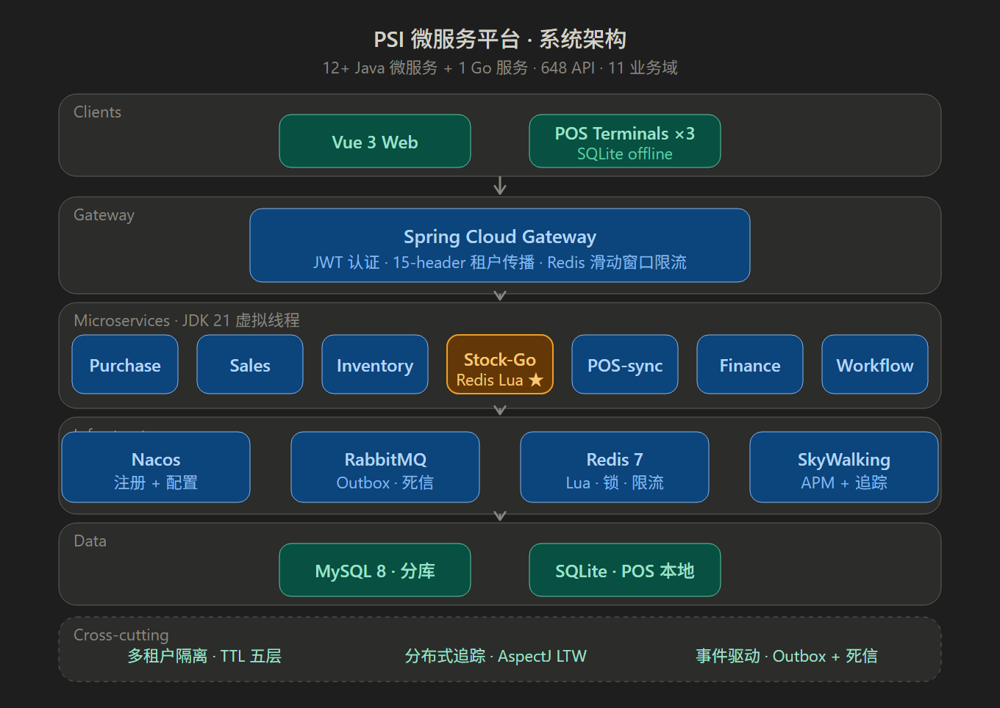

# PSI Microservices Platform

> Enterprise-grade **Purchase · Sales · Inventory · POS · Finance** SaaS platform built with Java 21 + Go, deployed across African markets.



---

## Why This Project Matters

This is not a demo or a tutorial project. It's a **production system** designed and delivered as **sole architect** — from requirements analysis to production deployment — serving real retail businesses in Zambia.

| Metric | Value |
|--------|-------|
| Microservices | 12 Java + 1 Go |
| API Endpoints | 648 |
| Database Entities | 120+ |
| Maven Modules | 24 |
| MQ Consumers | 30+ |
| Codebase | 84K+ lines Java, 17K+ lines Vue |
| Business Domains | 11 (procurement, sales, inventory, POS, finance, workflow, etc.) |
| Data Consistency | **Zero data loss** under high concurrency |

---

## Tech Stack

| Layer | Technologies |
|-------|-------------|
| **Language** | Java 21 (Virtual Threads), Go 1.21 |
| **Backend** | Spring Boot 3.2, Spring Cloud 2023, Spring Cloud Alibaba, Spring Security 6, MyBatis-Plus |
| **Microservices** | Nacos (Discovery + Config), Spring Cloud Gateway, OpenFeign, Resilience4j |
| **Messaging** | RabbitMQ (Dead Letter Queues, Delayed Messages, Transactional Outbox, Idempotent Consumers) |
| **Data** | MySQL 8 (Database-per-Service), Redis 7 (Lua Scripts / Distributed Lock / Rate Limiting), SQLite (POS offline) |
| **Observability** | SkyWalking APM, Custom Distributed Tracing (AspectJ LTW) |
| **Frontend** | Vue 3.5, Vite 6, Element Plus, vue-i18n |
| **DevOps** | Docker, Docker Compose, Nginx, Flyway |

---

## Architecture Highlights

### 1. Hybrid Java + Go Inventory Engine

The core inventory service uses **Go for high-concurrency stock pre-deduction** with Redis Lua atomic scripts, while Java services handle business orchestration. A four-layer concurrency defense ensures zero data loss:

```
Redis pre-deduct (atomic)  →  DB CAS optimistic lock  →  Go mutex  →  automatic compensation
```

- Resilience4j circuit breaker (50% failure threshold, 2s slow-call detection) wraps Go calls
- Custom Nacos HTTP client in Go for service discovery
- Feature toggles enable **zero-downtime Go/Java canary switching**

### 2. Five-Layer Multi-Tenant Isolation

Tenant context propagates across HTTP → Feign → MQ-producer → MQ-consumer → async-thread via Alibaba TTL. A custom MyBatis-Plus `InnerInterceptor` auto-appends tenant filters to all SQL — with table whitelisting, alias detection, and UNION skipping.

**Zero business-code intrusion** across 12 services.

### 3. Event-Driven Messaging Stack

Three-layer MQ architecture with transactional outbox pattern:

- `MqMessageFacade` → `TtlRabbitTemplate` → tenant interceptor
- `afterCommit()` dispatch ensures messages are only sent after DB transaction succeeds
- 10 domain-specific dead letter queues with retryability assessment
- Custom `@RabbitConsumerACK` AOP annotation for declarative ACK/NACK
- Redis idempotency (24h TTL) prevents duplicate processing

### 4. Custom Distributed Tracing

AspectJ Load-Time Weaving (LTW) intercepts all methods under `com.psi.*`:
- **Zero overhead** on normal execution (hot-path auto-skip > 100 invocations)
- Trace context propagates across HTTP, Feign, RabbitMQ, and async threads
- SkyWalking APM integration for end-to-end visibility

### 5. POS Offline-First Sync

Bidirectional sync between cloud MySQL and POS SQLite:
- **Down-sync:** incremental pull with batch confirmation
- **Up-sync:** idempotent inserts with retry tracking
- Custom Flyway-compatible SQLite migration framework with file-level security
- Supports 3 independent cashier terminals

### 6. African Market Localization

- **Mobile Money payments:** Airtel / MTN / Zamtel integration
- Multi-currency exchange rate management
- VAT tax compliance
- Bilingual i18n (EN/ZH) via ResourceBundle + vue-i18n

---

## Quick Start

### Prerequisites

- JDK 21+
- Go 1.21+
- Docker & Docker Compose
- Node.js 18+ (for frontend)

### Run Infrastructure

```bash
docker-compose up -d mysql redis rabbitmq nacos
```

### Build & Run

```bash
# Clone
git clone https://github.com/moyuping-java-architect/inventory-pos-microsystem.git
cd inventory-pos-microsystem

# Build all modules
mvn clean package -DskipTests

# Start services (order matters)
java -jar psi-gateway/target/psi-gateway.jar
java -jar psi-auth/target/psi-auth.jar
java -jar psi-inventory-go  # Go inventory engine
# ... start remaining services as needed
```

---

## Project Structure

```
inventory-pos-microsystem/
├── psi-gateway/              # Spring Cloud Gateway (JWT auth, rate limiting)
├── psi-auth/                 # Authentication & authorization
├── psi-inventory/            # Inventory service (Java)
├── psi-inventory-go/         # Inventory engine (Go, high-concurrency)
├── psi-purchase/             # Procurement domain
├── psi-sales/                # Sales & order management
├── psi-pos/                  # POS with offline sync
├── psi-finance/              # Finance & VAT compliance
├── psi-workflow/             # SpEL-based workflow engine
├── psi-tenant/               # Multi-tenant framework
├── psi-tracing/              # Custom distributed tracing (AspectJ LTW)
├── psi-common/               # Shared libraries & utilities
├── psi-api/                  # API definitions & DTOs
├── docs/
│   └── architecture.svg      # System architecture diagram
└── docker-compose.yml        # Infrastructure setup
```

---

## Design Decisions

| Decision | Rationale |
|----------|-----------|
| **Go for inventory engine** | Stock deduction is the highest-concurrency, lowest-latency path. Go's goroutines + Redis Lua outperform JVM for this specific bottleneck. |
| **Database-per-service** | Each microservice owns its schema. Cross-service queries go through API contracts, not shared tables. |
| **Transactional outbox** | Decouples message dispatch from business logic. Messages are only sent after the DB transaction commits — no lost messages. |
| **AspectJ LTW over annotation-based** | Captures all method calls automatically, including third-party library calls. No manual annotation needed. |
| **SQLite for POS** | Cashier terminals must work offline. SQLite provides local persistence with bidirectional sync to cloud MySQL. |
| **Virtual threads (JDK 21)** | Massive concurrency without the memory overhead of platform threads. TTL propagates context across all 6 execution modes. |

---

## License

This project is open-sourced under the [MIT License](LICENSE).

---

<sub>Built as sole architect at Jiangding (2024–2026), deployed in production across Zambian retail operations.</sub>
